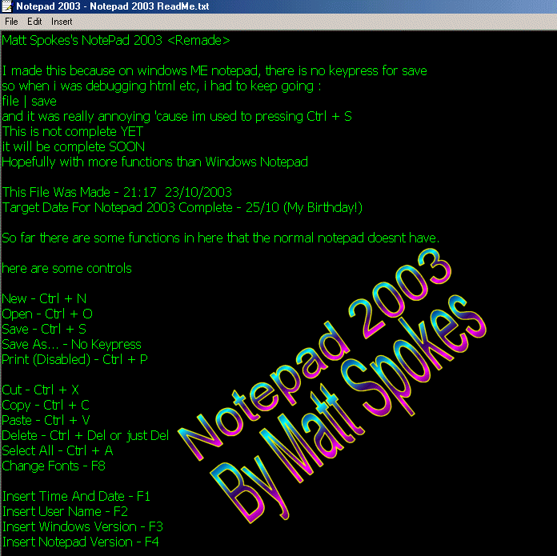



## Notepad 2003

### Description

<27/10 UPDATE : Has every function that notepad has plus some of my own, Find And Replace added> Notepad 2003 is a remake of notepad, with a couple more functions. such as colors,insert name,insert windows version insert computer name etc.
 
### More Info
 

             |
---                |---
**Submitted On**   |2003-10-26 20:24:28
**By**             |[Matt Spokes](https://github.com/Planet-Source-Code/PSCIndex/blob/master/ByAuthor/matt-spokes.md)
**Level**          |Intermediate
**User Rating**    |4.9 (39 globes from 8 users)
**Compatibility**  |VB 5\.0, VB 6\.0
**Category**       |[Miscellaneous](https://github.com/Planet-Source-Code/PSCIndex/blob/master/ByCategory/miscellaneous__1-1.md)
**World**          |[Visual Basic](https://github.com/Planet-Source-Code/PSCIndex/blob/master/ByWorld/visual-basic.md)
**Archive File**   |[Notepad\_2016635310272003\.zip](https://github.com/Planet-Source-Code/matt-spokes-notepad-2003__1-49404/archive/master.zip)

